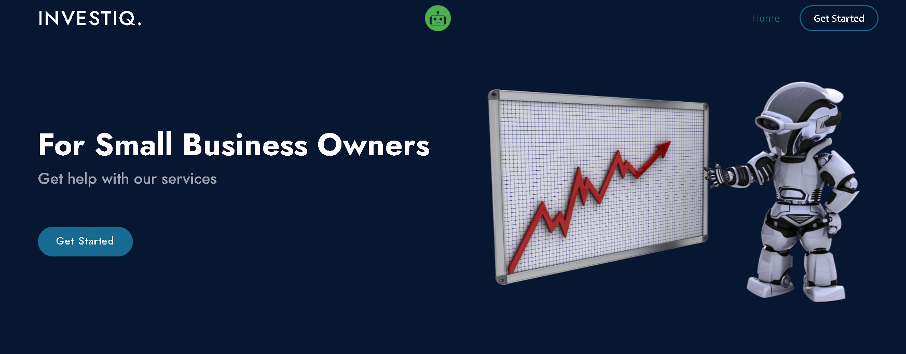
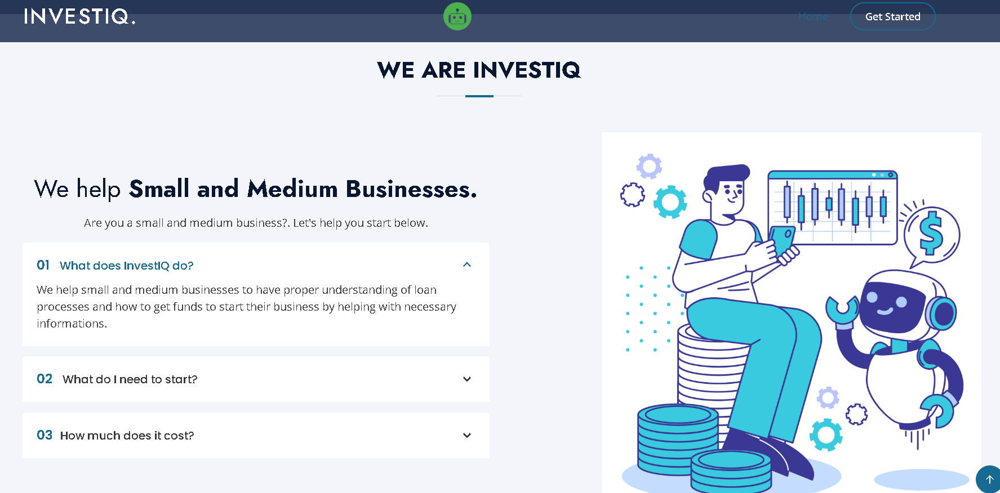
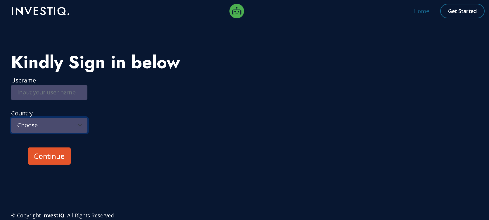
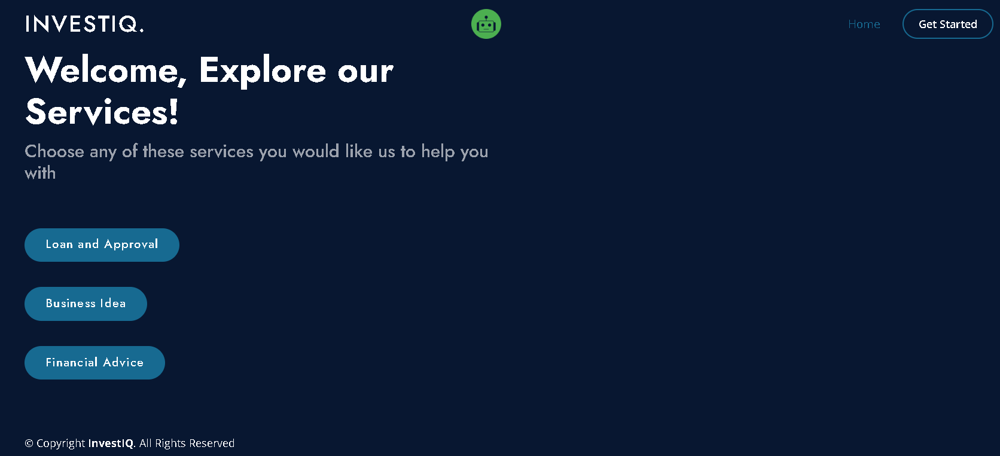
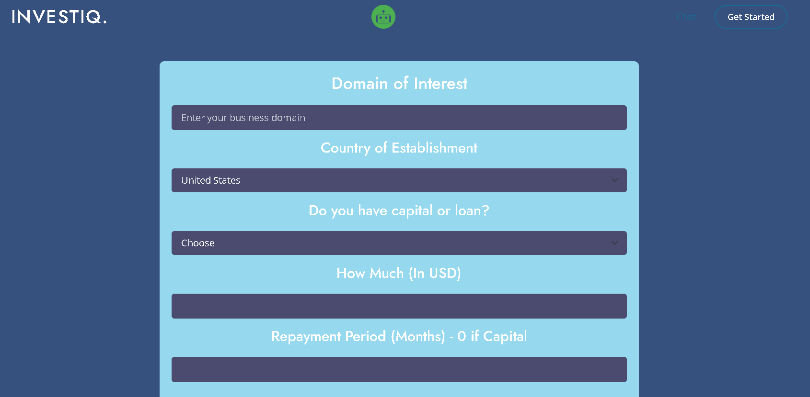
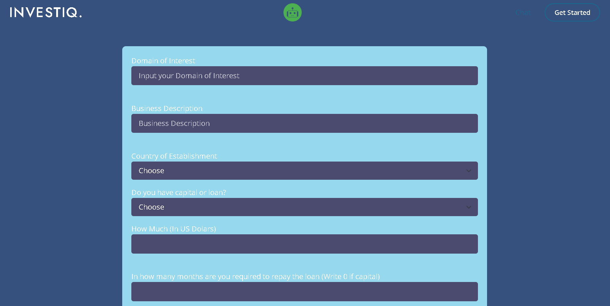

# InvestIQ - AI-Powered Financial & Business Advisory Website for SMEs


## 📍 Overview
InvestIQ is an advanced website offering personalised financial and business advice for Small and Medium Enterprises (SMES). By leveraging **Gemini API 2.0** and machine learning, this platform assists SMES with loan predictions, business idea generation, and financial advice, enabling them to make informed decisions for growth.

### Home Page
- **Description**: The homepage introduces the core features of InvestIQ and provides easy navigation to the key services.
- **Screenshots**: Home Page 1 :

  
  

  Home Page 2 :

    

### Sign In and Available Services
- **Description**: Users can securely sign in to access personalised services, including loan prediction, business idea generation, and financial advice.
- **Screenshots**:
   Sign In Page :

 
  
   Available Services :
    

### Loan Prediction Service
- **Description**: Predicts loan approval chances based on user-provided financial information.
- **Functionality**:
  - Loan prediction based on financial details.
  - AI chat is available for additional queries and guidance.
- **Screenshots**: Loan Form : 
  
    

### Business Idea Generator
- **Description**: Generates personalised business ideas based on user inputs, such as capital, location, and sector.
- **Functionality**:
  - AI-driven business idea generation.
  - Chat interface for further exploration.
- **Screenshots**: Business Idea Form :

  
   

### Financial Advice Service
- **Description**: Provides personalised financial advice for SMES based on the user’s business needs and economic status.
- **Functionality**:
  - Custom financial advice based on user inputs.
  - AI-powered chat for more detailed guidance.
- **Screenshots**: Financial Advice Form :

    

## Additional Features
- **Interactive User Interface**:
  - Backend: Flask.
  - Frontend: HTML, CSS, JavaScript.
- **Online Accessibility**:
  - Hosted on Render.

The platform provides a user-friendly interface, offering SMES essential tools and AI-driven insights for their business needs.

---

## 📍 Installation and Setup

### Prerequisites
- Python 3.x
- Pip (Python package manager)
- Gemini API Key 2.0 for accessing the generative AI functionality.


## Installation Steps 🚀:
Follow these steps to set up and run the InvestIQ application on your local machine:

**1. Clone the repository**
Open your terminal and run the following command to clone the project:

```bash
git clone https://github.com/Ananyasingh2002/InvestIQ.git
```
```bash
cd InvestIQ
```
**2. Prepare the environment**

Delete the existing .env file (if present):

```bash

rm .env
```
**3. Open and run the Prediction.ipynb notebook in Jupyter or VS Code to ensure everything is functioning properly**

Make sure all required packages used in the notebook are installed. You can install missing packages using:

```bash
pip install package_name
```
**4. Set up API and Flask secret keys**
Open app.py and do the following:

Replace the placeholder for your API secret key appropriately:


```bash
app.secret_key = "your_flask_secret_key_here"
```
To generate a secure key, run:

```bash
python -c "import secrets; print(secrets.token_hex(16))"
```
**5. Install dependencies**
Ensure Python 3 is installed, then install the necessary packages from requirements.txt:

```bash
pip install -r requirements.txt
```
**6. Run the application**
Start the Flask server by running:

```bash
python app.py
```
**7. Open the application in your browser**

Go to:

```bash
http://127.0.0.1:5000
```

